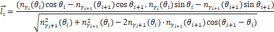

# 问题一

$$
\\ 螺线方程: r=8.8+\frac{0.55}{2\pi}\theta \qquad (1)
\\点坐标 (r\cdot cos(θ), r\cdot sin(θ))
\\龙头的速度恒定 走的距离 为 vt , v=1m/s，
\\弧长的计算公式 f(x)=\frac{1}{2}x \sqrt{x^2+1}+\frac{1}{2}ln(|x+\sqrt{x^2+1}|) \qquad(2)
\\g(x)=\frac{0.55}{2\pi}(f(x+32\pi)-f(32\pi)) \qquad (3)
\\g(x)=t \qquad(4)
\\由 (1) (2) 解得 x=?  \qquad(5)
\\在t时刻的龙头前把手的位置为 ： \overrightarrow {v_1}=(r_1 cos \theta_1, r_1 sin \theta_1) \qquad(5)
\\在已知\theta_1的情况下,求\theta_2，限定\theta_2 - \theta_1\in (0,\pi)：
\\g(\theta_2)={r_2}^2-2r_1r_2\cos{(\theta_2-\theta_1)}+{r_1}^2 \qquad (6)
\\b 为一个常数
\\g(\theta_2)=b^2 \qquad (7)
\\求得\theta_2 的 值 为其所有解中的最小值 \qquad (8)
\\g(\theta_n)=b^2 ,n>=3\qquad (9)
\\\theta_n = h(b) \qquad (10)
\\按照此方法，在已知 \theta_n求\theta_{n+1},就可以得到每一点的\theta值，进而求出位置
\\
$$

$$
\\求速度
\\x=r\times \cos{\theta}
\\y=r\times \sin{\theta}
\\r'=\frac{0.55}{2\pi}
\\v_x=-r\sin{\theta}+r'\cos{\theta}
\\v_y=r\cos{\theta}+r'\sin{\theta}

\\ v_n 表示速度的单位向量
\\ v_n =({v_x}_n,{v_y}_n)
\\ \vec{l}=(r_n\cos{\theta_n}-r_{n+1}\cos{\theta_{n+1}},r_n\sin(\theta_n)-r_{n+1}\sin{\theta_{n+1}})=(\cos{\alpha_n},sin{\alpha_n})
\\ u_n 表示速度的大小
\\ u_{n+1} = \frac{\vec{v_n}\cdot \vec l_{n}}{\overrightarrow{v_{n+1}} \cdot \vec l_{n}} \cdot u_n
\\v_0 \: 表示车头的速度
$$

分离者定理

# 问题二

$$
\vec{h_n} \text{ 是垂直于 } \vec{l_n} \text{ 的单位向量} \\
t_n > 300 \text{（暂定），表示时间} \\

(a_{1_0}, b_{1_0}) = (x_0, y_0) + 0.15\vec{h_0} + 0.275\vec{l_0} \\
(a_{2_0}, b_{2_0}) = (x_0, y_0) + 0.15\vec{h_0} - 3.135\vec{l_0} \\
(a_{3_0}, b_{3_0}) = (x_0, y_0) - 0.15\vec{h_0} + 0.275\vec{l_0} \\
(a_{4_0}, b_{4_0}) = (x_0, y_0) - 0.15\vec{h_0} - 3.135\vec{l_0} \\

\text{-------} \\

\vec{a_{1n}} = (x_n, y_n) + 0.15\vec{h_n} + 0.275\vec{l_n} \\
\vec{a_{2n}} = (x_n, y_n) + 0.15\vec{h_n} - 1.925\vec{l_n} \\
\vec{a_{3n}} = (x_n, y_n) - 0.15\vec{h_n} + 0.275\vec{l_n} \\
\vec{a_{4n}} = (x_n, y_n) - 0.15\vec{h_n} - 1.925\vec{l_n} \\

1 \leq n \leq 13 \\

\text{分离轴定理} \\

({c_0}_n, {d_0}_n) = \left(\min(\vec{a_{in}} \cdot \vec{l_0}), \max(\vec{a_{in}} \cdot \vec{l_0})\right) \\
({e_0}_n, {f_0}_n) = \left(\min(\vec{a_{in}} \cdot \vec{h_0}), \max(\vec{a_{in}} \cdot \vec{h_0})\right) \\
({c_1}_n, {d_1}_n) = \left(\min(\vec{a_{i_0}} \cdot \vec{l_n}), \max(\vec{a_{i_0}} \cdot \vec{l_n})\right) \\
({e_1}_n, {f_1}_n) = \left(\min(\vec{a_{i_0}} \cdot \vec{h_n}), \max(\vec{a_{i_0}} \cdot \vec{h_n})\right) \\
\text{如果 } (c_n, d_n) \cap (c_0, d_0) \neq \emptyset \text{ 且 } (e_n, f_n) \cap (e_0, f_0) \neq \emptyset \\
\text{则停止运行，返回 } t_n \\

({c_2}_n, {d_2}_n) = \left(\min(\vec{a_{in}} \cdot \vec{l_1}), \max(\vec{a_{in}} \cdot \vec{l_1})\right) \\
({e_2}_n, {f_2}_n) = \left(\min(\vec{a_{in}} \cdot \vec{h_1}), \max(\vec{a_{in}} \cdot \vec{h_1})\right) \\

({c_3}_n, {d_3}_n) = \left(\min(\vec{a_{i_1}} \cdot \vec{l_n}), \max(\vec{a_{i_1}} \cdot \vec{l_n})\right) \\
({e_3}_n, {f_3}_n) = \left(\min(\vec{a_{i_1}} \cdot \vec{h_n}), \max(\vec{a_{i_1}} \cdot \vec{h_n})\right) \\

\text{如果 } (c_n, d_n) \cap (c_1, d_1) \neq \emptyset \text{ 且 } (e_n, f_n) \cap (e_1, f_1) \neq \emptyset \\
\text{则停止运行，返回 } t_n


\\ 两种情况，只考虑 前13个，
\\ 1. 龙头撞龙身
 
\\ 2. 龙身撞龙身
$$

---


# 问题三

$$
\\ 螺线方程： r=4.5+\frac{p}{2\pi}\theta
\\ p 表示螺距，初始值 \:p = 2m
\\ 初位置 \: r= 4.5 + 3p
\\ 初始值 \theta = 6\pi
\\ t= t_0
\\ t'=t-t_0
\\f(x)=\frac{1}{2}x \sqrt{x^2+1}+\frac{1}{2}ln(|x+\sqrt{x^2+1}|)
\\ g(x)=\frac{p}{2\pi}(f(\frac{9\pi}{p}+6\pi)-f(x+\frac{9\pi}{p}+6\pi))
\\ g(x)=t
\\ 求x=? 即 \theta=x+\theta

\\
\\ 检测相撞时间 \: t_撞
\\ 若 \: g(-6\pi) < t_撞，则在\: p\in (0,2)之间进行二分法
\\ 如果 g(-6\pi) > t_撞，则 p取(1,2)部分进行二分
\\ 如果 g(-6\pi) < t_撞，则 p取(0,1)部分进行二分
\\ 当区间范围小于 \frac{1}{10^3}小于时停止
$$

```python
def f(x):
    return 0.5 * x * np.sqrt(x**2 + 1) + 0.5 * np.log(abs(x + np.sqrt(x**2 + 1)))

g(-6π) = p \ (2 * np.pi) * (f(9 * np.pi / p + 6* np.pi) - f(-6 * np.pi + 9 * np.pi / p + 6 * np.pi)) 
```

# 问题四

注意：
$$
\\ 新的螺线方程 \: r = 4.5 + \frac{1.7}{2\pi}\theta \qquad (m1)
\\ 圆d 的极坐标方程 :\: 9 + (\frac{1.5}{\tan{\alpha}})^2+{m_2}^2 - 2 \sqrt{9 + (\frac{1.5}{\tan{\alpha}})^2} \cdot m_2 \cos{(\theta - \arctan{\frac{\tan \alpha}{2}})} = (\frac{1.5}{\tan{\alpha}})^2 \qquad (m2) \: 范围 m_2 < 0
\\ 圆e 的极坐标方程 :\: 2.25 + (\frac{3}{\tan{\alpha}})^2 + {m_3}^2 - 2 \sqrt{9 + (\frac{3}{\tan{\alpha}})^2 } \cdot m_3 \cos{(\theta - \arctan{(2 \tan{\alpha})}+ \pi)} = (\frac{3}{\sin{\alpha}})^2   \qquad(m3) \: 范围 m_3 > 0
\\ m3(\theta) = \sqrt{9 + \left(\frac{3}{\tan(\alpha)}\right)^2} \cdot \cos\left(\theta - \arctan\left(2 \cdot \tan(\alpha)\right)\right) + \sqrt{\left(9 + \left(\frac{3}{\tan(\alpha)}\right)^2\right) \cdot \cos\left(\theta - \arctan\left(2 \cdot \tan(\alpha)\right)\right) - \left(\frac{3}{\tan(\alpha)}\right)^2 - 2.25 + \left(\frac{3}{\sin(\alpha)}\right)^2}
\\ 盘出螺线的极坐标方程 :\: r_4 = 4.5 + \frac{1.7}{2\pi}\theta - \frac{1.7}{2}\qquad (m4)
\\ \alpha = \arcsin{\frac{m_1(0)}{\sqrt{{m_1(0)}^2+{m_1'(0)}^2}}}
\\ \beta = \arcsin{\frac{1}{\sqrt{3 {\sin{\alpha}}^2+1}}}
$$


$$
\int_0^t{\sqrt{{m_2}^2 + (\frac{dm_2}{d\theta})^2}}
$$


## 在不同时间段求解$\theta_0$的公式

---

$$
\\ t < 0  时，g(\theta)=t+100, 反解出 \theta_0
$$

---

$$
\\ 0 \leq t < \frac{\pi}{2} + \beta时, \theta= - \frac{\sin \alpha}{1.5}t
$$

---

$$
\\ (\frac{\pi}{2} + \beta) *1.5 / \sin{\alpha}\leq t < \frac{3\alpha}{\sin \alpha} 时，\theta = \frac{\sin{\alpha}}{1.5}(t-\pi-2\beta)
$$

---

$$
\\ \frac{3\alpha}{\sin \alpha} \leq t < \frac{9 \alpha}{\sin \alpha} 时，\theta = \frac{\sin \alpha}{3} t
$$

---

$$
\frac{9\alpha}{\sin \alpha} \leq t 时， g(\theta) - g(3\alpha) = t - \frac{9\alpha}{\sin \alpha}
$$

---


## 求不同的时间段 的所有$\theta$的值

$$
\\ 当 t < (\frac{\pi}{2} + \beta) *1.5 / \sin{\alpha} 时，  \gamma_n = 1 (所有 \gamma 都等于1)
\\ \gamma 只有1和2两个值，每个 \theta 都有两个状态，分别对应两种 \: r
$$

求解出$\theta$ 后，用下面这个式子求解出所有的 $\theta$ 值 （用 $\theta_n$ 计算 $\theta_{n+1}$）


---

$$
\\当t >(\frac{\pi}{2} + \beta) *1.5 / \sin{\alpha}\:时， \gamma_0 =2
$$

使用下面的公式来计算 ,用下面这个式子求解出所有的 $\theta$ 值 （用 $\theta_n$ 计算 $\theta_{n+1}$）


每求一个 $\theta$ 值。都要做一次下面的判定
$$
\\ 若 \theta_{n+1} > -(\frac{\pi}{2} + \beta) *1.5 / \sin{\alpha}，则令\: \gamma_{n+1}=2，并且始终使用上面的公式计算 \theta_{n+1},且每次都要进行相同的判断
\\ 若 \theta_{n+1} < -(\frac{\pi}{2} + \beta) *1.5 / \sin{\alpha}，则令\: \gamma_n=1 \:且 之后的 \gamma_{i (i>n)} = 1
$$
然后根据判定结果，使用下面的公式求出真正的 $\theta_{n+1}$


然后使用上面的公式进行计算，同样每次都要进行判断。

进而求索龙身各个部分的 $\theta$ 值。

---

## 将 极坐标 $\theta$ 转为直角坐标系

$$
x_i=  n_{\gamma_i}(\theta_i)\cdot \cos{\theta_i}
\\y_i= n_{\gamma_i}(\theta_i)\cdot \sin{\theta_i}
$$

## 求所有点的单位方向向量$\vec l$




## 求所有点的速度的大小

$$
\\v_x=-n_{\gamma_i}\sin{\theta}+n_{\gamma_i}'\cos{\theta}
\\v_y=n_{\gamma_i}\cos{\theta}+n_{\gamma_i}'\sin{\theta}
\\ 单位方向向量 \vec v_i = (v_x,v_y)
\\ |v_{n+1}| = \frac{\vec{v_n}\cdot \vec l_{n}}{\overrightarrow{v_{n+1}} \cdot \vec l_{n}} \cdot |v_n|
$$


$$

$$

# 问题五

爬山算法

## 生成初始解

$$
将初始解 v_0' 设为 1.7m/s
$$

## 定义目标函数

$$
目标函数\: E(v_n') 为 龙头初速度为 v_n' 的情况下，整个运动过程中出现过的把手的最大速度。
$$

## 生成邻域解

$$
对于初始的 v 值，选择 
\\ \delta_1 = 0.1
\\ \delta_2 = 0.03
\\ \delta_3 = 0.01
\\ 来生成三个不同的领域解 \: v_n' + \delta_i(i=1,2,3)
$$

## 评估领域解

$$
代入邻域解 v_n' + \delta_i(i=1,2,3) 并计算 目标函数 E(v_n')，判定是否满足约束条件；若 E(v_n')>2则舍弃该解
$$

## 选择最优邻域解

$$
从未被舍弃的 E(v_n')中选取最大的 v_n'值
$$

## 检查是否达到停止条件